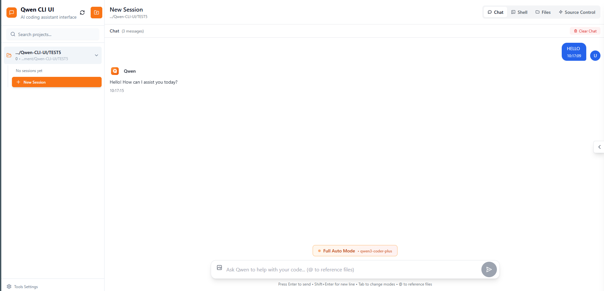
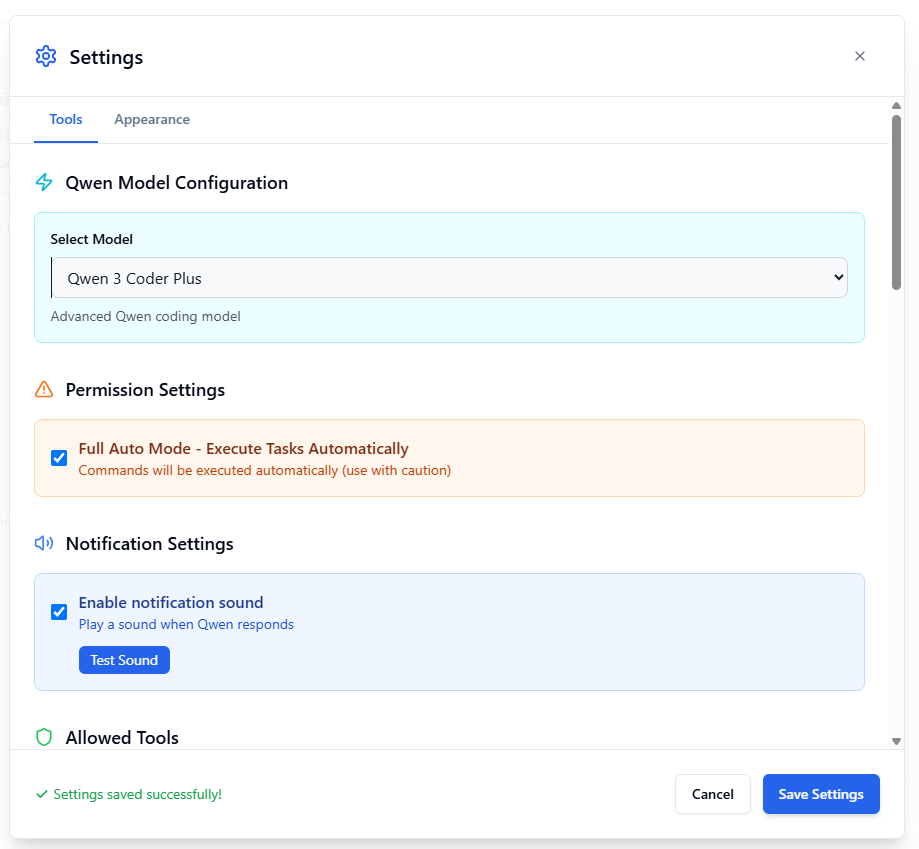

# Qwen CLI UI

อินเทอร์เฟซเว็บสมัยใหม่ที่ตอบสนองได้ดีสำหรับ Qwen Code CLI โดย 제공อินเทอร์เฟซแชทที่ใช้งานง่ายพร้อมการจัดการไฟล์ ประวัติเซสชัน และความสามารถในการแก้ไขโค้ด

## คุณสมบัติ

- 🤖 **อินเทอร์เฟซแชทแบบโต้ตอบ** - การสื่อสารด้วย AI assistant Qwen อย่างลื่นไหล
- 📁 **ตัวเรียกดูไฟล์** - เรียกดู ดู และแก้ไขไฟล์โครงการด้วยการเน้นไบซิน์
- 🔄 **การจัดการเซสชัน** - บันทึก กลับมาใช้ใหม่ และจัดการเซสชันแชทหลายรายการ
- 🎨 **ธีมมืด/สว่าง** - ปรับแต่งหน้าตาได้ด้วยการตรวจจับธีมอัตโนมัติ
- 🛠️ **เทอร์มินัลแบบบูรณาการ** - การเข้าถึง shell ในตัวสำหรับการรันคำสั่งโดยตรง
- 📝 **ตัวแก้ไขโค้ด** - ตัวแก้ไขอิง Monaco พร้อมการเน้นไบซิน์และ IntelliSense
- 🔒 **การยืนยันตัวตนที่ปลอดภัย** - ระบบรับรองความถูกต้องด้วย JWT
- 📱 **ออกแบบมาสำหรับทุกอุปกรณ์** - ปรับให้เหมาะกับเดสก์ทอป แท็บเล็ต และมือถือ

## ภาพหน้าจอ

<div align="center">
<table>
<tr>
<td align="center">
<h3>อินเทอร์เฟซแชท</h3>

<br>
<em>อินเทอร์เฟซแชทหลักพร้อมภาพรวมโครงการ</em>
</td>
<td align="center">
<h3>แผงการตั้งค่า</h3>

<br>
<em>การตั้งค่าและการตั้งค่าโมเดล</em>
</td>
</tr>
</table>
</div>

## สิ่งที่ต้องมี

- Node.js 18+ และ npm
- Qwen CLI ติดตั้งและสามารถเข้าถึงได้ใน PATH
- สภาพแวดล้อมแบบ Unix-like (Linux, macOS, WSL)

## เริ่มต้นอย่างรวดเร็ว

### 1. โคลน Repository

```bash
git clone https://github.com/cruzyjapan/Qwen-CLI-UI.git
cd qwen-cli-ui
```

### 2. ติดตั้ง Dependencies

```bash
npm install
```

### 3. ตั้งค่า Environment

สร้างไฟล์ `.env` ในไดเรกทอรีราก:

```env
# การกำหนดค่าเซิร์ฟเวอร์
PORT=5008
VITE_PORT=5009

# การกำหนดค่า Qwen CLI
AGENT_BIN=qwen
AGENT_MODEL_FLAG=--model
AGENT_SKIP_PERMISSIONS_FLAG=--yolo

# การยืนยันตัวตน (เปลี่ยนในผลิตภัณฑ์)
JWT_SECRET=your-secret-key-here

# Environment
NODE_ENV=development
```

### 4. เริ่มแอปพลิเคชัน

```bash
npm run dev
```

เข้าถึงแอปพลิเคชันที่:
- Frontend: http://localhost:5009
- API Server: http://localhost:5008

## คู่มือการใช้งาน

### การตั้งค่าเริ่มต้น
1. เปิดแอปพลิเคชันในเบราว์เซอร์
2. สร้างบัญชีผู้ดูแลระบบในการเปิดครั้งแรก
3. เลือกหรือสร้างไดเรกทอรีโครงการ
4. เริ่มแชทกับ Qwen!

### คุณสมบัติการแชท
- พิมพ์ข้อความและกด Enter เพื่อส่ง
- ใช้ `@` เพื่ออ้างอิงไฟล์โครงการ
- ลากและวางภาพเพื่อเพิ่มบริบทแบบเห็นภาพ
- ดูการใช้เครื่องมือในส่วนที่ขยายได้
- ตำแหน่งเลื่อนอัตโนมัติและโหมดเลื่อนด้วยตนเอง

### การจัดการไฟล์
- เรียกดูไฟล์ในแท็บไฟล์
- คลิกเพื่อเปิดในตัวแก้ไขแบบบูรณาการ
- บันทึกการเปลี่ยนแปลงด้วย Ctrl/Cmd + S
- การเน้นไบซิน์สำหรับภาษาหลักทั้งหมด

### การจัดการเซสชัน
- เซสชันบันทึกอัตโนมัติระหว่างการสนทนา
- กลับมาใช้เซสชันก่อนหน้าจากรางด้านข้าง
- ค้นหาประวัติเซสชัน
- ลบเซสชันเก่าเพื่อปลดปล่อยพื้นที่

## โครงสร้างโครงการ

```
qwen-cli-ui/
├── src/                    # Frontend React
│   ├── components/         # คอมโพเนนต์ UI
│   ├── contexts/          # React contexts
│   ├── hooks/            # Hooks แบบกำหนดเอง
│   └── utils/            # Utilities
├── server/                # Backend Express
│   ├── index.js          # เซิร์ฟเวอร์หลัก
│   ├── agent-cli.js      # การบูรณาการ Qwen
│   └── sessionManager.js # การจัดการเซสชัน
├── public/               # ส่วน assets คงที่
└── dist/                # Build สำหรับผลิตภัณฑ์
```

## การปรับใช้งานผลิตภัณฑ์

### Build สำหรับผลิตภัณฑ์

```bash
# Build frontend
npm run build

# เริ่มเซิร์ฟเวอร์ผลิตภัณฑ์
NODE_ENV=production npm start
```

### การปรับใช้งาน Docker

```bash
# Build Docker image
docker build -t qwen-cli-ui .

# รัน container
docker run -p 5008:5008 -p 5009:5009 \
  -e JWT_SECRET=your-secret-key \
  -v ~/.qwen:/root/.qwen \
  qwen-cli-ui
```

### คำแนะนำด้านความปลอดภัย

1. **เปลี่ยน JWT secret ค่าเริ่มต้น** - ใช้ secret ที่แข็งแรง vàสุ่มในผลิตภัณฑ์
2. **เปิดใช้งาน HTTPS** - ใช้ reverse proxy (nginx/caddy) กับ SSL certificates
3. **ตั้งค่า CORS** - จำกัด origins ในผลิตภัณฑ์
4. **อัปเดตเป็นประจำ** - อัปเดต dependencies เพื่อแพตช์ความปลอดภัย
5. **การควบคุมการเข้าถึง** - ใช้การยืนยันตัวตนและสิทธิ์ผู้ใช้อย่างเหมาะสม

## การแก้ไขปัญหา

### ปัญหาที่พบบ่อย

**การเชื่อมต่อ WebSocket ล้มเหลว**
- ตรวจสอบว่าเซิร์ฟเวอร์ทำงานอยู่บนพอร์ตที่ถูกต้อง
- ตรวจสอบการตั้งค่า firewall เพื่อให้อนุญาตการเชื่อมต่อ WebSocket
- ยืนยันว่าโทเค็นยืนยันตัวตนถูกต้อง

**Qwen CLI ไม่ตอบสนอง**
- ตรวจสอบการติดตั้ง Qwen CLI: `which qwen`
- ทดสอบ Qwen โดยตรง: `qwen --help`
- ตรวจสอบ logs เซิร์ฟเวอร์สำหรับข้อผิดพลาดรายละเอียด
- ยืนยันสิทธิ์ที่ถูกต้องสำหรับ executable Qwen

**เซสชันไม่บันทึก**
- ตรวจสอบสิทธิ์การเขียน: `~/.qwen/sessions/`
- ยืนยันพื้นที่ดิสก์เพียงพอ
- ตรวจสอบ logs เซิร์ฟเวอร์สำหรับข้อผิดพลาดระบบไฟล์

**ปัญหาการยืนยันตัวตน**
- ล้าง localStorage ของเบราว์เซอร์
- สร้าง JWT token ใหม่
- ตรวจสอบ logs การยืนยันตัวตนของเซิร์ฟเวอร์

## การพัฒนา

### การรันทดสอบ

```bash
npm test
```

### สไตล์โค้ด

```bash
npm run lint
npm run format
```

### การร่วมพัฒนา

1. Fork repository
2. สร้าง feature branch (`git checkout -b feature/amazing-feature`)
3. Commit การเปลี่ยนแปลง (`git commit -m 'Add amazing feature'`)
4. Push ไปที่ branch (`git push origin feature/amazing-feature`)
5. เปิด Pull Request

## เอกสาร API

เซิร์ฟเวอร์เปิดเผย RESTful APIs และ WebSocket endpoints:

### REST Endpoints
- `GET /api/projects` - รายการโครงการทั้งหมด
- `GET /api/projects/:name/sessions` - รับเซสชันโครงการ
- `POST /api/projects/:name/upload-images` - อัปโหลดภาพ
- `DELETE /api/sessions/:id` - ลบเซสชัน

### WebSocket Events
- `qwen-command` - ส่งคำสั่งไปยัง Qwen
- `qwen-output` - รับ outputs จาก Qwen
- `session-created` - การแจ้งเตือนเซสชันใหม่
- `qwen-complete` - การเสร็จสิ้นคำสั่ง

## ใบอนุญาต

MIT License - ดูไฟล์ [LICENSE](LICENSE) สำหรับรายละเอียด

## คำขอบคุณ

- สร้างขึ้นสำหรับ [Qwen Code CLI](https://github.com/QwenLM/Qwen)
- ขับเคลื่อนด้วย React, Vite และ Tailwind CSS
- Monaco Editor สำหรับการแก้ไขโค้ด
- เลียนแบบเทอร์มินัลด้วย node-pty
- Icons จาก Heroicons

## การสนับสนุน

สำหรับปัญหาและคำขอฟีเจอร์:
- เปิด issue บน [GitHub Issues](https://github.com/thaigqsoft/Qwen-CLI-UI-OLLAMA/issues)
- ตรวจสอบ [existing issues](https://github.com/thaigqsoft/Qwen-CLI-UI-OLLAMA/issues) สำหรับวิธีแก้ไข
- แนบ logs รายละเอียดเมื่อรายงานบั๊ก

---

<div align="center">
สร้างด้วย ❤️ สำหรับชุมชน Qwen
</div>
